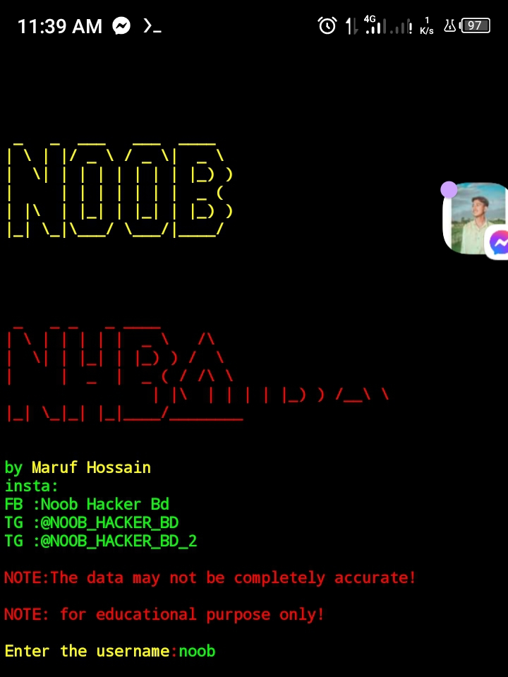

<!DOCTYPE html>
<html lang="en">
<head>
  <meta charset="UTF-8">
  <meta name="viewport" content="width=device-width, initial-scale=1.0">
  <meta http-equiv="X-UA-Compatible" content="ie=edge">
  <title>Document</title>
  
  

  
</head>
<body>
  
  <h1>Social media hunter</h1>
  
  
 
  
  

  
  

   
   
  
  

    <h1> Tool details</h1>
  

  
  

    
  

  
   
   
   
  
  
  
  

    <h3>apt update</h3>
    <h3>apt upgrade</h3>
    <h3>pkg install python</h3>
    <h3>pkg install git</h3>
    <h3>git clone https://github.com/NHBD71/Social-media-hunter.git</h3>
    <h3>ls</h3>
    <h3>cd Social-media-hunter</h3>
    <h3>python nhbd.py</h3>
  

   
   
  
 

  
  <h3>CONNECT ME ON  <a href="https://www.facebook.com/Toxic.Shiddik"><button style="padding: 6px;
      background: skyblue;
      border-radius: 10px;
      text-transform: uppercase;"><b>Facebook </b></button></a></h3>

  
  
  
  
</body>
</html>
